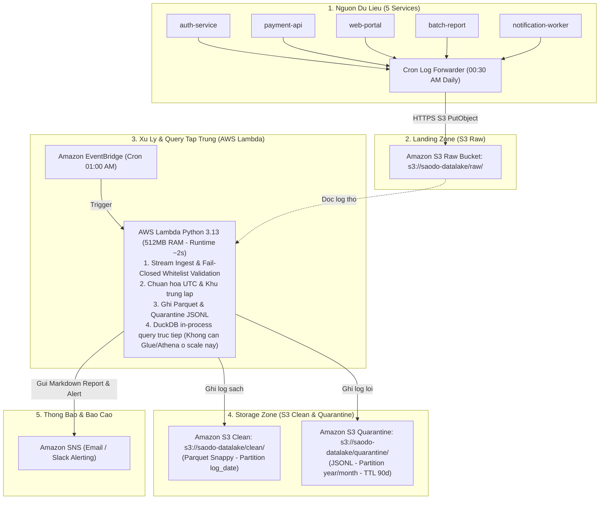
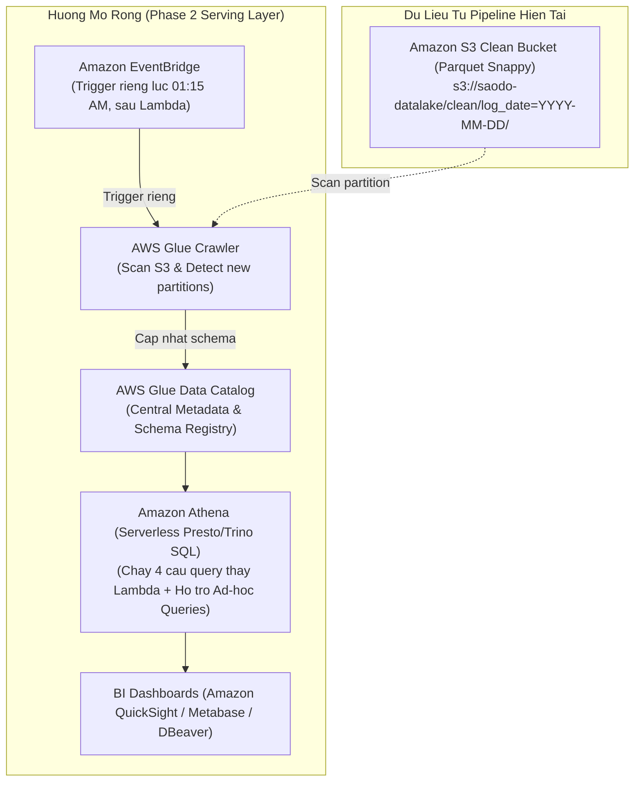

# Thiết kế Kiến trúc Pipeline Xử lý Log trên AWS (Phần A — Mục 4)

**Tài liệu thiết kế kiến trúc kỹ thuật (Technical Architecture Design)**  
**Dự án**: Xử lý & Phân tích Log Tập trung 5 Hệ thống Nội bộ  
**Khách hàng**: Công ty Tài chính Sao Đỏ  
**Quy mô dữ liệu hiện tại**: ~3.000 dòng log/ngày (~1MB/ngày), chạy định kỳ 01:00 AM  

---

## 🏗️ 1. Sơ đồ Kiến trúc HIỆN TẠI (Đúng scale bài test: ~3K dòng/ngày)

Kiến trúc **Lean Serverless** tối giản, tự gom xử lý và phân tích trọn vẹn trong một lần chạy Lambda mà không cần khởi tạo thêm các dịch vụ phân tích ngoài:

### Thuyết minh luồng xử lý hiện tại:
1. **00:30 AM**: Cron job trên máy chủ gom log của ngày hôm trước và upload lên `s3://saodo-datalake/raw/`.
2. **01:00 AM**: EventBridge kích hoạt AWS Lambda (Python 3.13).
3. **Trong Lambda (~2 giây)**:
   - Đọc stream, validate schema contract (whitelist service & level), chuẩn hóa múi giờ UTC, khử trùng lặp.
   - Ghi dữ liệu sạch ra **S3 Clean** (`.parquet` nén Snappy, partition theo `log_date`).
   - Ghi dữ liệu lỗi ra **S3 Quarantine** (`.jsonl`, partition `year/month`, cấu hình S3 Lifecycle xóa sau 90 ngày).
   - **Chạy trực tiếp 4 câu query SQL bằng DuckDB in-process** trên file Parquet vừa tạo (không tốn độ trễ mạng hay chi phí service ngoài).
4. **Báo cáo**: Lambda tổng hợp kết quả markdown và gửi thông báo qua **Amazon SNS** tới IT Ops / Email lãnh đạo.

---

## 🚀 2. Sơ đồ Hướng MỞ RỘNG khi Data Tăng (Phase 2)

Khi dữ liệu lớn hơn hoặc phát sinh nhu cầu phân tích đa phòng ban, kiến trúc tách biệt tầng **ETL Compute** và **Interactive Query Serving**:

### Điểm khác biệt ở Phase 2:
- **Tách lịch Trigger**: EventBridge kích hoạt Glue Crawler vào lúc **01:15 AM** (sau khi Lambda đã hoàn tất ghi file Parquet lúc 01:00 AM), không chạy chung lịch với Lambda.
- **Tách tầng Query**: Thay vì Lambda tự query bằng DuckDB nội bộ, **Amazon Athena** đóng vai trò là Serverless Query Engine tập trung trên nền **Glue Data Catalog**.

---

## ⚖️ 3. Ngưỡng Chuyển Đổi & Quy Tắc Nâng Cấp (Transition Triggers)

> **Nguyên tắc cốt lõi**: **KHÔNG cần đổi cả 2 (Compute & Query) cùng lúc**. Nâng cấp độc lập từng phần tùy theo điểm nghẽn (bottleneck) thực tế.

### 1. Khi nào cần đổi COMPUTE (từ Lambda $\rightarrow$ AWS Glue Job / EMR)?
- **Ngưỡng dữ liệu**: Khi dung lượng log thô vượt quá **~500 MB – 1 GB/ngày** (tương đương **> 3 – 5 triệu dòng log/ngày**).
- **Lý do kỹ thuật**:
  - AWS Lambda bị giới hạn cứng thời gian chạy tối đa **15 phút** và RAM tối đa **10 GB**.
  - Khi dữ liệu lớn, việc đọc/parse JSON và ghi Parquet trong 1 single thread của Lambda sẽ bị quá tải bộ nhớ (OOM) hoặc chạm timeout 15 phút.
  - $\rightarrow$ Lúc này chuyển code làm sạch sang **AWS Glue Job (PySpark)** để phân tán xử lý đa node song song.

### 2. Khi nào cần đổi QUERY SERVING (từ DuckDB in-Lambda $\rightarrow$ Glue Catalog + Athena)?
- **Ngưỡng nhu cầu**: Khi xuất hiện **nhu cầu truy vấn Ad-hoc và nhiều người/dashboard cùng sử dụng**:
  - Có các đội ngũ khác (BI Team, Business Analysts, Audit, Security) cần tự viết SQL truy vấn dữ liệu theo các tiêu chí tùy biến, không chỉ 4 câu query cố định.
  - Cần kết nối trực tiếp vào các công cụ BI (QuickSight, PowerBI, Tableau, Metabase) qua chuẩn JDBC/ODBC.
  - Cần phân quyền bảo mật dữ liệu ở cấp độ bảng/cột (Column-level security qua AWS Lake Formation).
- **Lý do kỹ thuật**: DuckDB in-process trong Lambda chỉ sống trong vòng đời của Lambda execution, không thể phục vụ truy vấn đồng thời từ bên ngoài.

### 3. Bảng Tóm tắt Quyết định Kỹ thuật:

| Tình huống thực tế | Tầng Compute (ETL) | Tầng Query (Phân tích) | Hành động nâng cấp |
| :--- | :--- | :--- | :--- |
| **Hiện tại (~3K log/ngày, 4 câu query cố định)** | **AWS Lambda (Python)** | **DuckDB (In-process)** | Giữ nguyên kiến trúc hiện tại, chi phí $0/tháng. |
| **Nhiều team muốn tự viết SQL trên log sạch** | **AWS Lambda (Python)** | **Athena + Glue Catalog** | Chỉ thêm Crawler + Athena, **giữ nguyên Lambda ETL**. |
| **Log tăng vọt > 5 triệu dòng/ngày (vẫn 4 query cố định)** | **AWS Glue Job (PySpark)** | **DuckDB / Script SQL** | Chỉ nâng cấp Lambda lên Glue Job, **chưa cần Athena**. |
| **Log > 10 triệu dòng/ngày + Đa phòng ban truy vấn BI** | **AWS Glue Job (PySpark)** | **Athena + Glue Catalog** | Nâng cấp toàn diện cả 2 tầng. |
