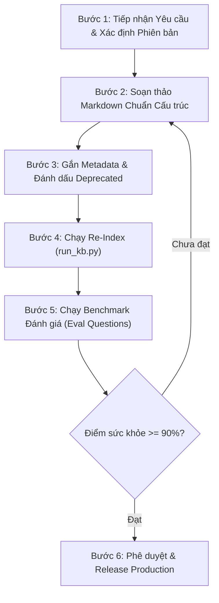

# SOP — Quy Trình Cập Nhật & Duy Trì Knowledge Base (Freshness & Re-indexing)

**Mã tài liệu**: `SOP-KB-01`  
**Đơn vị ban hành**: Đội ngũ Data Engineering & Vận hành Hệ thống — Công ty Tài chính Sao Đỏ  
**Phiên bản**: `1.0` · **Ngày hiệu lực**: `08/2026` · **Người duyệt**: Trưởng phòng CNTT  

---

## 🎯 1. Mục Đích & Phạm Vi Áp Dụng

- **Mục đích**: Thiết lập quy trình chuẩn để cập nhật, bổ sung và duy trì tính tươi mới (**Freshness**) của Knowledge Base phục vụ Trợ lý AI (RAG), ngăn chặn triệt để tình trạng AI trả lời theo các chính sách/runbook đã lỗi thời hoặc bị bãi bỏ.
- **Phạm vi áp dụng**: Áp dụng cho toàn bộ các tài liệu vận hành (`FAQ`, `GUIDE`, `RUN`, `SOP`) và tài liệu chính sách (`POL`) lưu trữ tại thư mục `data/docs/` và hệ thống Knowledge Base nội bộ.

---

## 👥 2. Phân Định Trách Nhiệm (RACI Matrix)

| Vai trò | Chức danh đảm nhiệm | Trách nhiệm chính trong quy trình |
| :--- | :--- | :--- |
| **Document Owner (Tác giả tài liệu)** | Kỹ sư trưởng hệ thống / Trưởng nhóm phụ trách | Soạn thảo nội dung kỹ thuật mới, xác định phiên bản cũ cần bãi bỏ. |
| **KB Operator (Kỹ sư quản trị KB)** | Data Engineer phụ trách Knowledge Base | Đánh giá cấu trúc chunking, cập nhật metadata, chạy lại pipeline re-index và bộ benchmark eval. |
| **Approver (Người phê duyệt)** | Trưởng phòng Vận hành / Trưởng phòng CNTT | Ký duyệt chính thức tài liệu mới và duyệt báo cáo kiểm thử chất lượng RAG trước khi release. |

---

## 🔄 3. Quy Trình 6 Bước Cập Nhật Knowledge Base (End-to-End SOP)



---

### 📝 Bước 1: Tiếp nhận Yêu cầu & Phân loại Thay đổi
Khi có thay đổi về hạ tầng, quy trình vận hành hoặc chính sách quản trị:
1. Xác định rõ loại thay đổi:
   - **Tạo mới (New Doc)**: Ví dụ ra mắt service mới hoặc quy trình mới.
   - **Cập nhật thay thế (Major Version Update)**: Ví dụ chính sách `POL-01 v2` thay thế toàn bộ `POL-01 v1`.
   - **Chỉnh sửa nhỏ (Minor Patch)**: Sửa số điện thoại liên hệ, cập nhật link dashboard.

---

### 📝 Bước 2: Soạn thảo Markdown Chuẩn Cấu trúc Chunking
Để đảm bảo bộ parser `MarkdownChunker` cắt chunk chuẩn xác:
- **Tiêu đề tài liệu**: Đặt ở dòng đầu tiên dạng `# [MÃ] — [Tên tài liệu]`.
- **Dòng thông tin phiên bản**: Ngay dưới H1 ghi rõ: `**Công ty Tài chính Sao Đỏ — Phòng CNTT** · Phiên bản X.X · Ban hành: MM/YYYY · [Ghi chú thay thế nếu có]`.
- **Cấu trúc mục**: Phân chia các nội dung hành động rõ ràng bằng các Heading `## [Mục lớn]` hoặc `### [Mục con]`.
- **Nguyên tắc "Tự chứa ngữ nghĩa"**: Mỗi mục H2/H3 phải bao gồm đầy đủ triệu chứng, nguyên nhân, lệnh thực thi và lưu ý an toàn.

---

### 📝 Bước 3: Cập nhật Metadata & Xử lý Xung đột Phiên bản (Conflict Resolution)
Để đảm bảo nguyên tắc **Freshness**:
1. Nếu tài liệu mới **thay thế hoàn toàn** tài liệu cũ:
   - Tài liệu mới được gán `"status": "ACTIVE"` và `"version": "v2.0"`.
   - Tài liệu cũ bắt buộc phải được chuyển trạng thái sang `"status": "DEPRECATED"`.
2. Không xóa vĩnh viễn file cũ ngay lập tức (để phục vụ kiểm toán lịch sử), nhưng bộ lọc tìm kiếm `active_only=True` sẽ tự động cô lập tài liệu cũ.

---

### 📝 Bước 4: Chạy Re-Indexing Dữ liệu
Kỹ sư Data Engineer thực hiện chạy lệnh tái lập chỉ mục:
```bash
# Lệnh cập nhật lại chunks.json và SQLite FTS5 index
py -3.13 kb/run_kb.py
```
- Hệ thống sẽ tự động quét lại toàn bộ thư mục `data/docs/`, sinh lại `kb/output/chunks.json` và cập nhật cơ sở dữ liệu `kb/output/knowledge_base.db`.

---

### 📝 Bước 5: Chạy Bộ Benchmark Kiểm Thử (Regression Testing)
Sau khi re-index, hệ thống tự động chạy qua bộ 10 câu hỏi chuẩn (`kb/eval/eval_questions.json`) để đo lường:
1. **Retrieval Hit Rate ($\ge 90\%$)**: Tài liệu mới có được tìm thấy khi hỏi đúng từ khóa không?
2. **Groundedness ($\ge 90\%$)**: Câu trả lời có bám sát tài liệu mới không, có bị bịa thông tin không?
3. **Version Trap Resolution ($100\%$)**: Khi hỏi về nội dung bị thay đổi, AI có trả lời theo bản mới không hay bị lẫn sang bản cũ?
4. **Out-of-scope Handling ($100\%$)**: Các câu hỏi ngoài phạm vi có bị từ chối chính xác không?

👉 **Nếu Điểm sức khỏe tổng thể (Overall Score) $< 90\%$**: Hoãn việc phát hành, rà soát lại từ khóa (keywords) và cấu trúc Heading của tài liệu.

---

### 📝 Bước 6: Phê duyệt & Đưa vào Vận hành (Production Release)
- Báo cáo kết quả kiểm thử [kb/eval_results.md](file:///d:/DE-assessment/kb/eval_results.md) được gửi cho Trưởng phòng Vận hành xem xét.
- Sau khi có chữ ký phê duyệt, cơ sở dữ liệu `knowledge_base.db` mới được đồng bộ lên máy chủ Production phục vụ Trợ lý AI.

---

## ⚠️ 4. Các Tình Huống Ngoại Lệ & Hướng Dẫn Xử Lý (Edge Cases)

| Tình huống sự cố | Triệu chứng phát hiện | Hành động xử lý ngay |
| :--- | :--- | :--- |
| **AI trích dẫn nhầm bản cũ** | Câu trả lời xuất hiện thông tin của bản `DEPRECATED` | Kiểm tra lại trường `status` trong file chunking và đảm bảo cờ `active_only=True` đang được bật trong Retriever. |
| **AI trả lời thiếu bước trong SOP** | Câu trả lời chỉ có bước 1 mà mất bước 2–3 | Do mục con bị cắt nhỏ quá mức. Cần gộp các bước liên hoàn vào chung một Heading H2 để giữ trọn ngữ cảnh. |
| **AI bịa câu trả lời khi hỏi ngoài luồng** | Câu hỏi ngoài phạm vi không bị từ chối mà AI tự bịa | Tăng ngưỡng điểm tương đồng tối thiểu (`relevance_threshold` từ 1.0 lên 2.5) trong `retriever.py`. |
